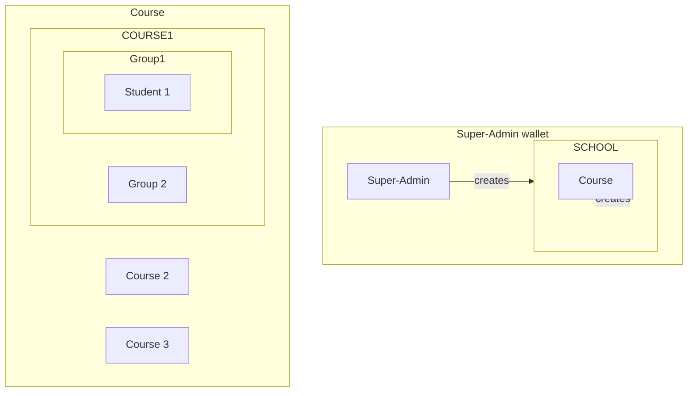

# Educhain Project Description

Educhain is a blockchain-based platform designed to facilitate educational management and administration.

# Business rules

Educhain can handle multiple schools.
Each school is created and managed by a unique super-administrator wallet.

This super-administrator can create multiple courses in his school.

He can assigns up to three administrators who will be responsible for managing each course.
Theses administrators define the different sessions (time slots) of the course.

Students have the flexibility to enroll in multiple Courses simultaneously.

Each administrator and each student has their own wallet.

Students must sign an on-chain attendance sheet for each session. 

Course admins have the authority to manually create groups of up to three Students within a Course. Each Student has the capability to initiate a Swap Request, indicating a desire to change groups within the same Course. This request is only fulfilled upon acceptance by a Student from the target group.

# Diagram

# Technical stack

## on-chain
- Solana
- Anchor
- Rust
- Typescript (testing)

## Front-end
- Framework Frontend: NextJS (y/c react)
- Component Lib: Ark-ui
- DesignSystem: Park-ui
- Sytling: PandaCss
- Typescript

## Hosting
-vercel.app
